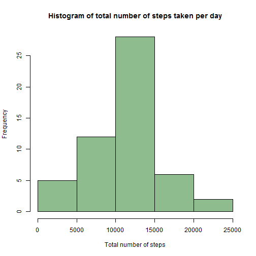
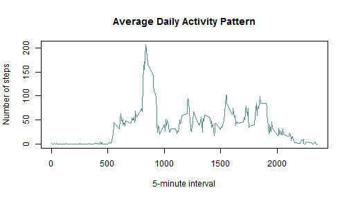
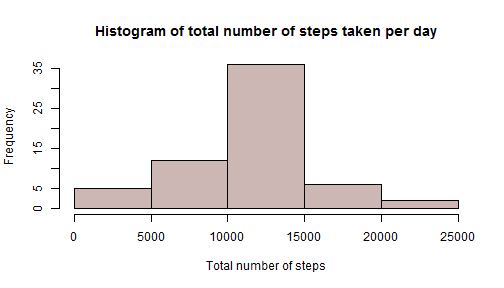

# **Personal Activity Monitoring Analysis**
By Hanh Cao
=========================================================
## **Introduction**

This project uses the data recorded from personal activity monitoring device. This device collects number of steps at 5-minute intervals of an anonymous person though out the day, from October to November, 2012. 

The variables in the original dataset include:
    - **steps**: Number of steps taking in a 5-minute interval
    - **date**: The date in YYYY-MM-DD format
    - **interval**: Identifier for the 5-minute interval in which measurement was taken.
    
Our goal is to conduct an analysis off mean total number of steps taken per day, the average daily acitivity pattern with and without including NA values. In addition, we also analyze the differences in activity patterns between weekdays and weekends.

-----------------------------------------------------------
## **Loading and preprocessing the data**


```r
download.file("https://d396qusza40orc.cloudfront.net/repdata%2Fdata%2Factivity.zip", destfile="activity.zip")
unzip("activity.zip")
data <-read.csv("activity.csv", header=T,stringsAsFactors=F)
```

## **What is mean total number of steps taken per day?**

Note: We will not account for NA in the first 2 questions

```r
## Subsetting of all complete cases in the original dataset
complete <- data[complete.cases(data),]

## Calculate the total number of steps taken per day
getsum <- aggregate(complete$steps, by=list(complete$date), FUN=sum)
names(getsum) <- c("date","steps.sum")

## Graph a histogram
hist(getsum$steps.sum,xlab="Total number of steps",main = "Histogram of total number of steps taken per day", col="darkseagreen")
```

 

```r
## Mean and median of the total number of steps taken per day
paste("Mean of total number of steps is ", round(mean(getsum$steps.sum),3), "and median is ", median(getsum$steps.sum))
```

```
## [1] "Mean of total number of steps is  10766.189 and median is  10765"
```

## **What is the average daily activity pattern?**

```r
## Calculate the mean of steps in each interval
getmean <- aggregate(complete$steps, by = list(complete$interval), mean)
names(getmean) <- c("interval","mean.steps")

## Plot the mean of steps for each interval
plot(getmean$interval,getmean$mean.steps, type="l", xlab="5-minute interval", ylab="Number of steps", main="Average Daily Activity Pattern", col="darkslategray4")
```

 

```r
max <- max(getmean$mean.steps)

paste("On average across all the days in the dataset, the 5-minute interval containing the maximum number of steps is ", getmean$interval[which(getmean$mean.steps==max)])
```

```
## [1] "On average across all the days in the dataset, the 5-minute interval containing the maximum number of steps is  835"
```

## **Imputing missing values**

Note: We take missing values into account.

Our strategy:

    - Take out the data with missing values
    - Replace them with the mean of steps of their according interval
    - Join with the portion of data containing only complete cases above
    The new generated dataset will have the same length as the original one.
    

```r
## Calculate the total missing values
totalNA <- sum(is.na(data))
paste("Total missing values is ", totalNA)
```

```
## [1] "Total missing values is  2304"
```

```r
totalNA <-data[is.na(data),]

## Replace NA value as the mean of 5-minute interval
totalNA$steps[which(totalNA$interval==getmean$interval)] <-getmean$mean.steps

##Create a new dataset where all missing values are filled in
library(plyr)
new <- join(totalNA,complete, by=c("date","interval"), type="full")

nrow(new)==nrow(data)  ## Check to see if total rows are the same as the original dataset
```

```
## [1] TRUE
```

```r
## Calculate the total number of steps taken per day
dat <- aggregate(new$steps, by=list(new$date), sum)
names(dat) <- c("date","steps.sum")

hist(dat$steps.sum,xlab="Total number of steps",main = "Histogram of total number of steps taken per day", col="mistyrose3")
```

 

```r
summary(dat$steps.sum)
```

```
##    Min. 1st Qu.  Median    Mean 3rd Qu.    Max. 
##      41    9819   10770   10770   12810   21190
```

```r
summary(getsum$steps.sum)
```

```
##    Min. 1st Qu.  Median    Mean 3rd Qu.    Max. 
##      41    8841   10760   10770   13290   21190
```
By replacing NA values by its 5-minute interval mean, median is a little smaller but the mean stays the same.

## **Are there differences in activity patterns between weekdays and weekends?**


```r
## Transforming data with an addition of a column indicating type of date
y <- new
y$date <- weekdays(as.Date(y$date))
y <- cbind(y,type=ifelse(y$date == "Saturday"|y$date == "Sunday", "weekend", "weekday"))

##Extract data for each type
weekday <- y[which(y$type=="weekday"),]
weekend <- y[which(y$type=="weekend"),]

## Find the mean of steps in each interval of each type
## Result is a 2-column data frame, adding 3rd column as type
wd.mean <- aggregate(weekday$steps,by=list(weekday$interval),mean)
wd.mean <- data.frame(interval=wd.mean$Group.1, mean=wd.mean$x, type="weekday")
wk.mean <- aggregate(weekend$steps,by=list(weekend$interval),mean)
wk.mean <- data.frame(interval=wk.mean$Group.1, mean=wk.mean$x, type="weekend")

## Combining both, so the head of dataset will be weekday, the tail will be weekend
processed  <- rbind(wd.mean,wk.mean)

## Using lattice graphic package to plot line graph.

library(lattice)
xyplot(mean~interval|type,data=processed,xlab="Interval", ylab="Number of steps",type="l", layout=c(1,2))
```

 

```r
dev.off()
```

```
## null device 
##           1
```
Conclusion:

The number of steps in weekends are distributes more evenly between each 5-minute intervals than that of weekdays.
